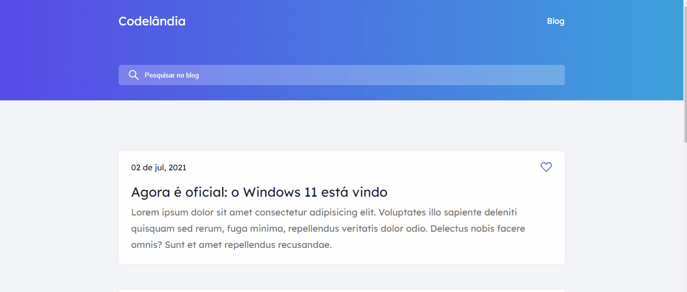
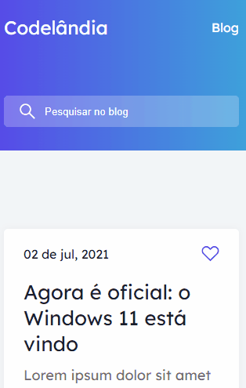

# Codelândia Blog

  

  

  

 

  📝Desafio 01 do discord Codelândia, onde foi solicitado a construção de uma página simples de um blog.

  🎨 <a href="https://www.figma.com/file/Yb9IBH56g7T1hdIyZ3BMNO/Desafios---Codel%C3%A2ndia?type=design&node-id=0-1&t=ZnbP0fA9MJcUFE4j-0">Figma do desafio </a>

   <a href="https://discord.com/channels/853354677411905578/853363178901733387">Discord </a>
  
  👾 <a href="https://samuelvitor1.github.io/Projetos-Desafios-LandingPages/Codel%C3%A2ndia%20Blog/index.html">Site</a>

  🖥️Tecnologias usadas:

   
 
    
    
  

