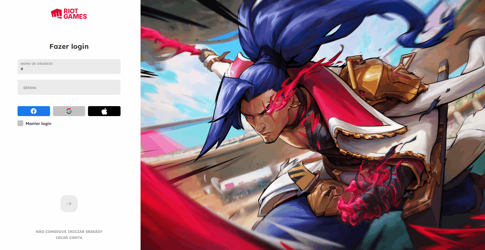

# Tela de Login do League of Legends

  

 

  📝Nesse vídeo foi ensinado a fazer a tela de login da Riot Games, foi muito legal fazer esse projetin,nele aprendi mais sobre validação de input e forEach e também revisei e aprendi conceitos novos de css.
  

   <a href="https://www.youtube.com/watch?v=tyVvNj-UvxM"> vídeo</a>
  

   

  👾 <a href="https://samuelvitor1.github.io/Projetos-Desafios-LandingPages/Tela-de-Login-RiotGames/index.html">Site</a>

  🖥️Tecnologias usadas:

   
 
    
    
  

